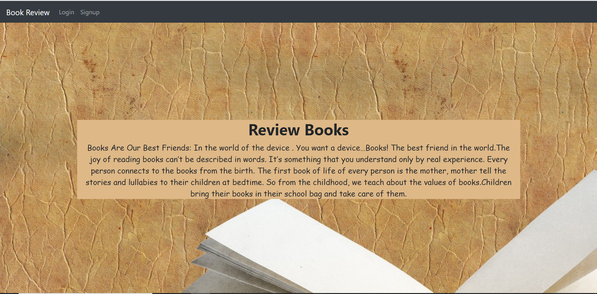
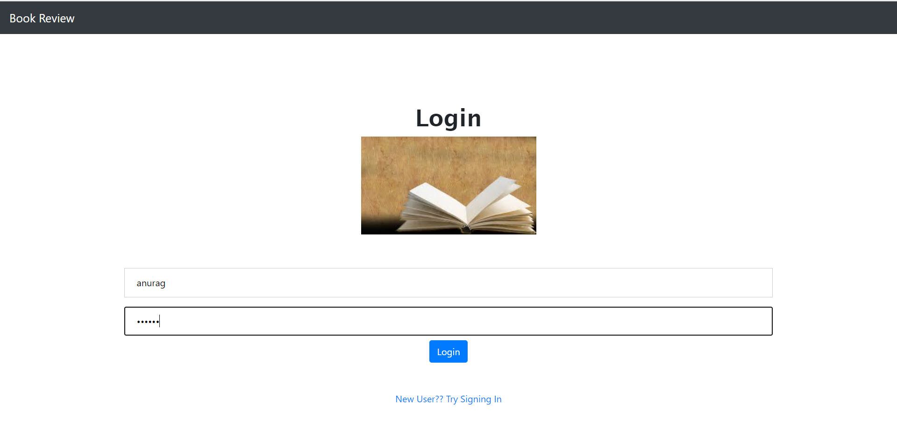
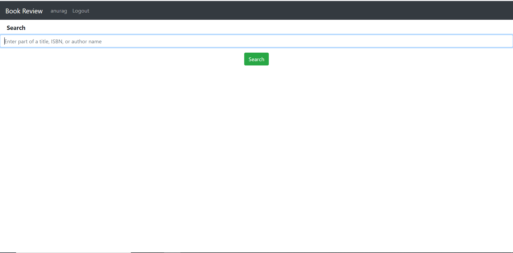
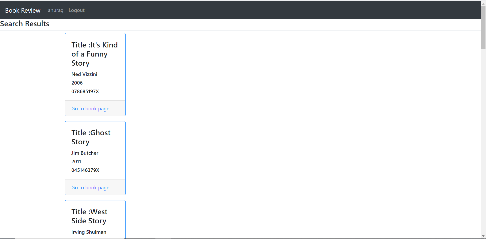
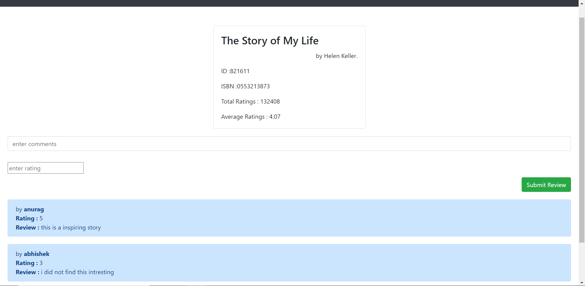

# Book-Review-Website
A simple website for brushing up concepts of Html, Css, Flask and Postgres-SQL

# How to run the project
- Install python 3 (3.7 or higher) and add python to path
- Clone the repository using cmd or bash:
```shell
git clone https://github.com/ABX9801/Book-Review-Website.git
```
- Install requirements using cmd or bash:
```shell
pip install -r requirements.txt
```
- Run the server in using cmd or bash:
```shell
flask run
```
- You will get a link in bash or cmd like http://127.0.0.1:5000/
- The website will run on this link

# Website screenshots
### Homepage


### Login Page
- register page is also similar


### Search Page


### Search Results Page


### Book Information Page

